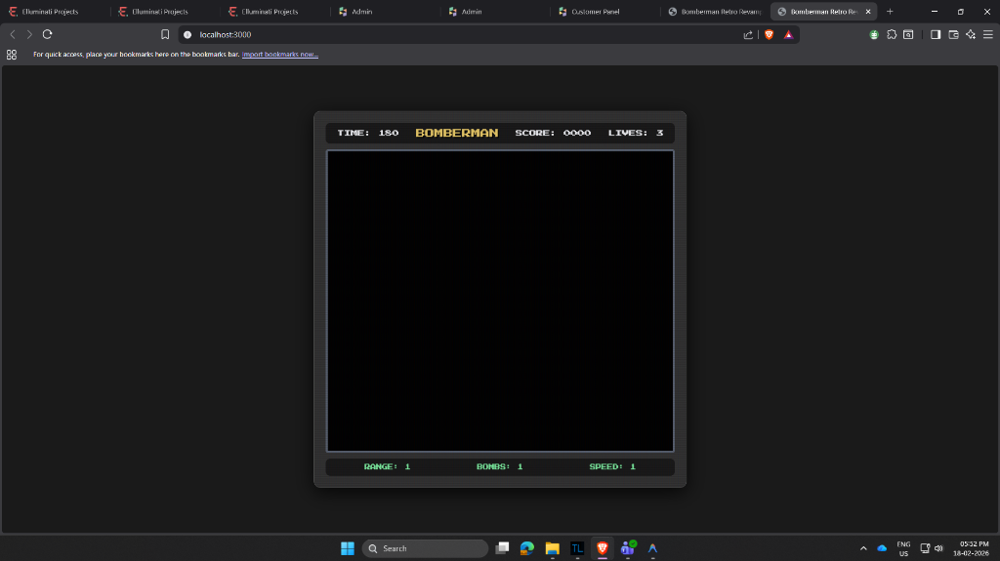

# 💀 Skull Bomber - Retro Revamped



**Skull Bomber** is a high-octane, retro-inspired Bomberman revamp featuring skeleton warriors, dynamic themes, and a challenging level progression system. 

## 🚀 Key Features
- **Dynamic Themes**: Switch between **Classic Minimal**, **Bomberman Retro** (NES Style), and **Neon Cyber** aesthetics.
- **Level System**: A 3-level campaign with increasing difficulty, more enemies, and faster movement.
- **Character Evolution**: Transform into the **Skeleton Warrior 2** form upon picking up power-ups!
- **Retro Audio**: Custom synth background music with a dedicated HUD toggle.
- **SEO Optimized**: Fully tagged for discoverability as "Skull Bomber" and "Retro Bomberman".

## 🎮 How to Play
1. **Move**: Use `W`, `A`, `S`, `D` or **Arrow Keys**.
2. **Place Bomb**: Press `Space`.
3. **Objective**: Eliminate all enemies (Creepy Balloons) to advance to the next level.
4. **Victory**: Clear Level 3 to achieve total victory!

## 🛠️ Performance & Tech
- **Vanilla JavaScript**: Pure logic, no heavy frameworks.
- **Canvas API**: High-performance procedural rendering.
- **Theme Engine**: Instant theme switching using unified color states.

## 📦 Installation
Simply clone the repo and open `index.html` in your browser!
```bash
git clone https://github.com/RaviDandaiya/Skull-Bomber.git
```

---
